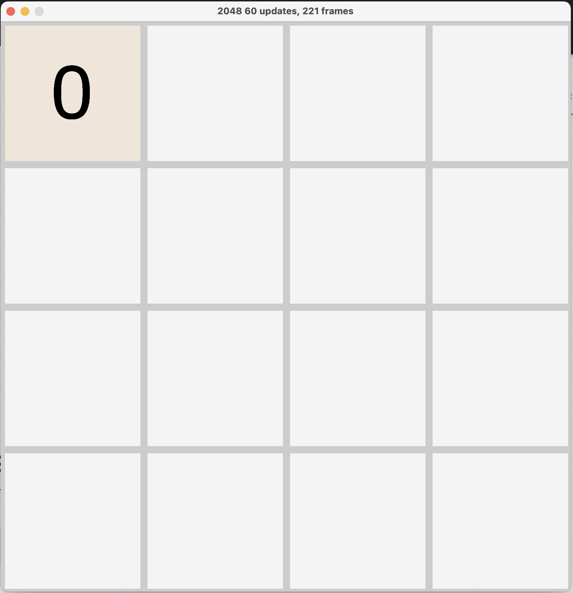

# 2048-Assignment
In this assignment you will be recreating the hit game 2048. 2048 is a sliding tile puzzle game. The game has three simple steps.

1. User's press a directional key and all the tiles on the grid are shifted in that direction. 
2. Tiles that are shifted toward each other and have the same value are merged. This creates a new tile with double the 
value.
3. A new tile is spawned randomly on an empty square.

Users continue in this loop until all the tiles in the grid are filled and there are no possible moves left that will
result in a merged tile.

Please give [2048](https://play2048.co/) a go here. The better you can understand the game, the easier it will be to
develop it.

## Exercise

### Defining the grid
We have created a skeleton of 2048 which you can use to develop the game. In your IDE try running the skeleton. If
everything has gone correctly you should be seeing this:


You should notice it's way too small. You need to increase the size of the game's grid. Have a look around the code and try
to find out what field you need to change to make the game into a 4x4 grid.

Once you've done that you should see something more like this:



### Adding numbers to our tiles
In 2048 all tiles have a value. All values are powers of two. The smallest possible value is two. If you compare your
application to the full game you will see that your tile is numbered zero. You will need to find the bug in the code which
is causing all the tiles to display the number zero. 

Once you've managed to do so, the game should look like this:


<details>
  <summary>Numbers code clue</summary>
    You know that all values are to the power of two so try to find where the tile's value is raised by a power.
</details>

### Moving tiles around

You may have noticed that you cannot move the tiles around. You will need to implement this. The update() function in
GameSquare is unimplemented. If you navigate there, there are some instructions on how to implement the function so that
your tiles will move around.

*Please note that we are using W, A, S and D for moving the tiles around. You can change this in the movingLogic() 
function.*


```shell
The user presses D or whichever key is set to move right.
```


### Spawn a random tile
The code for spawning a new tile has already been written. But it is not being called. Take some time to work out when 
you should call spawn().

<details>
  <summary>Spawn Point</summary>
    The code to spawn a new tile should be part of the moving logic.
</details>


### 
